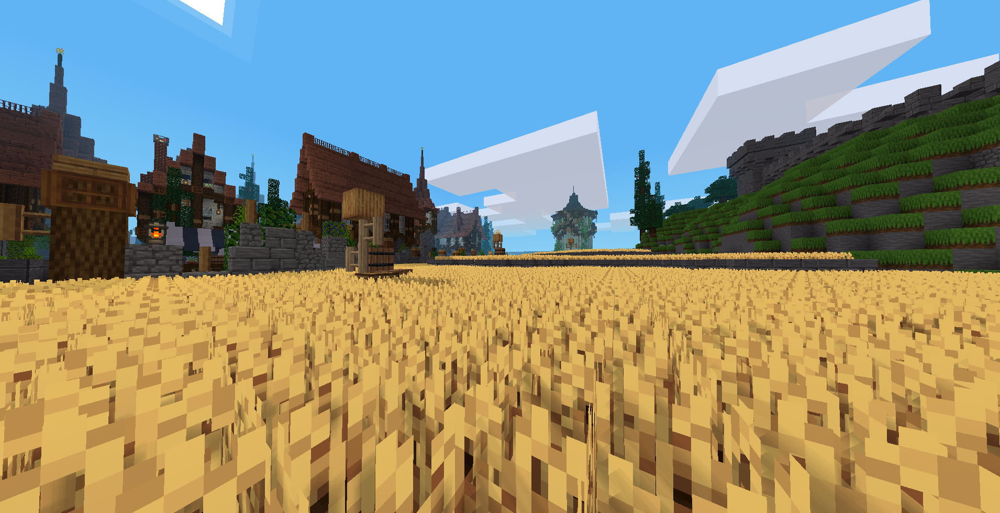

# Skylith Modpack

Skylith Modpack is a Luanti/Minetest modpack built for the Skylith server.
It provides the server core, minigame tools, arena systems, player settings,
shared utilities, and Skywars.

Official server: ~~`sw.minetest.land:30002`~~



## What You Get

### Minigames

- **Skywars**: playable Skywars game with maps, chests, spawns, teams, HUD, and match flow.
- **Minigame API**: shared system used to register games, maps, players, teams, timers, inventories, and arena states.
- **Minigame Editor**: in-game editor for creating, editing, duplicating, validating, and saving minigame maps.
- **Minigame Access**: access helpers for joining or leaving games cleanly.
- **Minigame Chat**: game/team chat tools for minigame sessions.

### Server Gameplay

- **MS Arena**: arena gameplay layer and shared arena utilities.
- **MS Portal**: lobby portals and teleport helpers.
- **MS Rankings**: ranking display and player stat helpers.
- **MS Items**: shared custom items.
- **MS Entities**: shared custom entities.
- **Echo Stone**: gameplay item/system for echo stone features.
- **3D Armor**: forked armor support.

### Server Tools

- **MS Main**: server basics and common player flow.
- **MS Utils**: shared helper functions used across the modpack.
- **MS Commands**: useful server commands.
- **MS Settings**: player/server settings API.
- **MS Announce**: announcement tools.
- **HUD API**: reusable HUD helpers.
- **Custom Crosshair**: configurable crosshair support.
- **MS Area**: forked area/protection support.

## Useful Commands

Some commands may require staff privileges depending on the server setup.

- `/settings` opens player settings.
- `/map_editor` opens the minigame map editor.
- `/list_games` lists registered minigames.
- `/list_maps <game>` lists maps for a minigame.
- `/join <game> <map>` joins a specific minigame map.
- `/watch <game> <map>` watches a running map.
- `/reload_maps` reloads minigame maps from disk.

## Creating Maps

Use `/map_editor` in-game to manage maps.

The editor lets you:

- create and edit maps;
- duplicate or delete existing maps;
- capture map bounds with `pos1` and `pos2`;
- add and move player spawns;
- edit game-specific properties;
- validate a map before saving it.

Minigame map data is saved in the world folder under `minigames/`.

## Creating New Games

New games should be registered through `minigame.register(...)`.
The API supports short matches, arena games, and persistent games.

Example for a persistent game such as Skyblock:

```lua
minigame.register("skyblock", {
    min_players = 1,
    max_players = 8,
    timed = false,
    end_match = false,
    map_regen = false,
    inventory_mode = "persistent",
    save_lobby_inventory = true,
    include_armor = true,
})
```

Use `MS Utils` when you need shared helpers for inventories, armor, player
state, health, chat, spawn handling, or common table operations.

More technical details are available in:

- `minigame_api/README.md`
- `ms_utils/README.md`

## Included Mods

- [3D Armor](https://github.com/minetest-mods/3d_armor) (forked)
- Custom Crosshair
- Echo Stone
- HUD API
- Minigame Access
- Minigame API
- Minigame Chat
- Minigame Editor
- MS Announce
- [MS Area](https://github.com/minetest-mods/areas/) (forked)
- MS Arena
- MS Commands
- MS Entities
- MS Items
- MS Main
- MS Portal
- MS Rankings
- MS Settings
- MS Utils
- Skywars

## Notes

- Built for the Skylith server and Luanti 5.15.
- Some mods are forks or server-specific versions.
- Keep shared logic in `ms_utils` or `minigame_api` when possible, so game mods stay small and easier to maintain.
